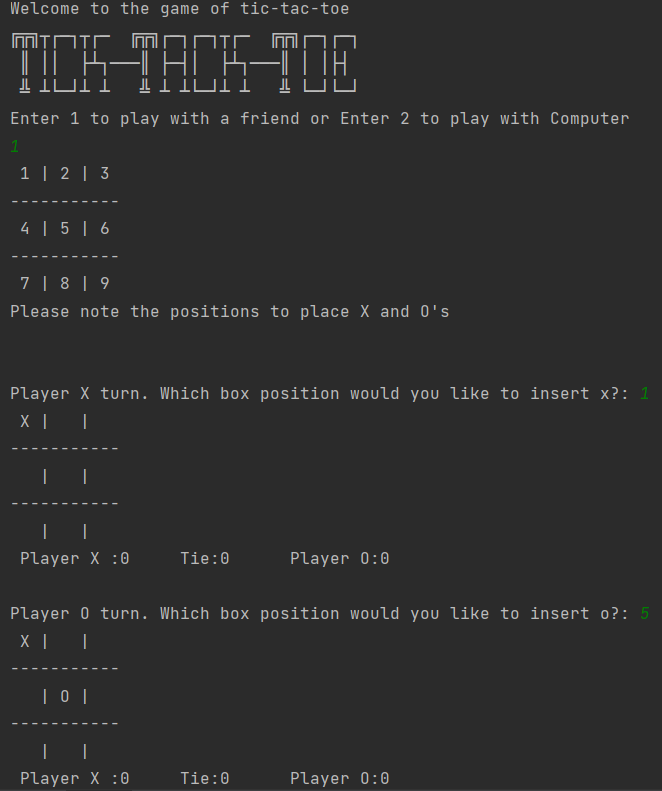
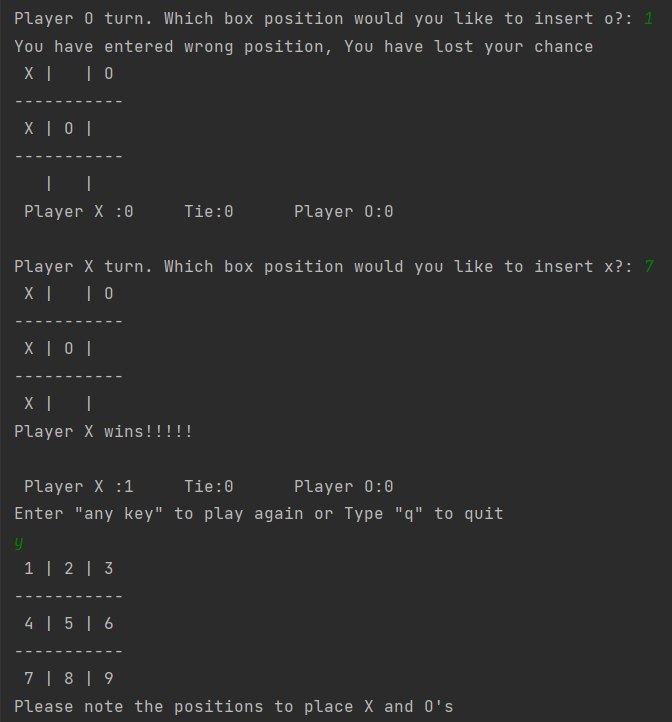
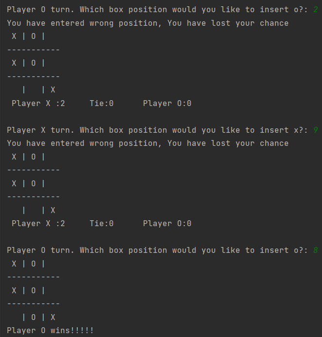
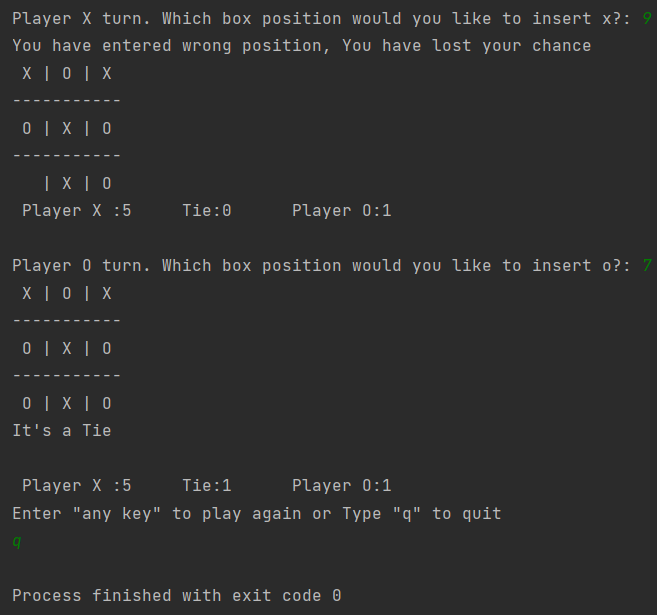

# Tic-Tac-Toe Game 🎮

A classic Tic-Tac-Toe game implemented in Python. Play against a friend or challenge the computer! 🤖

## Overview ℹ️

This Python application allows you to play the classic game of Tic-Tac-Toe. The game supports two players (Player X and Player O) or a single-player mode where you can challenge the computer. 🎯

## Features ✨

- Two-player mode: Play against a friend on the same computer. 👥
- Single-player mode: Challenge the computer (Uses the random module). 🧠
- Command-line interface (CLI) for gameplay. 💻
- Options for replaying the game or exiting. 🔄

## Getting Started 🚀

### Prerequisites 📋

- Python 3.x

## Example 🌟

- Example 1

- Example 2

- Example 3

- Example 4

